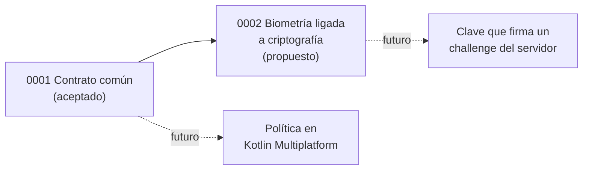

# Architecture Decision Records

Decisiones de arquitectura de kodivex-biometric-core. Formato basado en [MADR 4](https://adr.github.io/madr/), en español, con un resumen en una línea (Y-Statement) y un TL;DR en inglés al inicio de cada ADR.

| ADR | Decisión | Estado | Fecha |
|---|---|---|---|
| [0001](0001-shared-contract.md) | Un contrato de resultado común para biometría en iOS, Android y Flutter | Aceptado | 2026-10-05 |
| [0002](0002-crypto-bound-biometrics.md) | Ligar la biometría a una clave criptográfica en vez de un evento | Propuesto | 2026-10-05 |

## Reglas

- **Un ADR aceptado no se edita.** Si la decisión cambia, se escribe un ADR nuevo con `supersedes: ADR-NNNN` y el anterior pasa a `sustituido por ADR-NNNN`. Solo se permiten correcciones de typos y links rotos.
- **El ADR explica el porqué, no el cómo.** Las tablas normativas van en [`docs/spec/`](../spec/) y el detalle de implementación en [`docs/design/`](../design/); ambos se actualizan libremente.
- **Cada ADR dice cómo se confirma** (tests, CI, prueba en equipo real) y con qué nivel de confianza se tomó.
- Estados: `propuesto`, `aceptado`, `rechazado`, `obsoleto`, `sustituido por ADR-NNNN`.
- Para uno nuevo, copiar [`0000-template.md`](0000-template.md) con el siguiente número libre (los números no se reutilizan).
